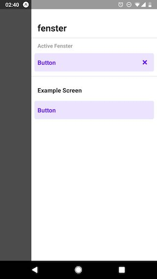

# fenster

fenster for React Native is a simple way to view and develop your components in
isolation. Compared to [storybook](https://storybook.js.org), fenster doesn't
use a second bundler and also doesn't expose another app. Instead fenster is
a part of your app and simply uses the metro bundler, which already bundles your
app. No worries, fenster won't be included in production builds.

fenster stores which component you're currently viewing, so even if you reload
the app to see changes, it won't lose its state.

## Table of Contents

- [Background](#background)
- [Install](#install)
- [Setup](#setup)
- [Usage](#usage)
- [License](#license)

## Background

> Fenster, das  
> n – /ˈfɛnstɐ/ – german for "window"

_fenster is a window into your app._

Viewing screens without navigating through your app is essential for fast and
comfortable development. React Native's hot module reloading isn't 100%
reliable, you don't want to navigate through your app all over again after
reloading the app.

Maybe you too temporarily changed the initial screen of your app, just to fix
some styling. And that's basically what fenster does: when active, fenster
renders a single component instead of the whole app.

## Install

```sh
npm install fenster
```

## Setup

Wrap your whole app inside `FensterRahmen` and pass an array of components,
which fenster should display.

```js
import React from 'react'
import { FensterRahmen } from 'fenster'

import HomeScreen from './HomeScreen'
import fenster from './fenster'

export default class App extends React.Component {
  render() {
    return (
      <FensterRahmen components={fenster}>
        <HomeScreen />
      </FensterRahmen>
    )
  }
}
```

```js
// fenster.js

import HomeScreen from './HomeScreen'
import FancyButton from './FancyButton'

export default [
  { name: 'Home Screen', component: HomeScreen },
  { name: 'FancyButton', component: FancyButton }
]
```

### `FensterRahmen`

The wrapper around your app. It controls the currently visible component (children
or an active fenster).

#### `components`

Array of objects `{ group, name, component }`.

- `group` (string, optional) allows you to group fensters. If you provide no
  group, it will show the component under "Components".
- `name` (string, required) is the display name in the list of fensters.
- `component` (React component, required) is the component to render.

Default: `[]`

Example:

```js
const components = [
  { group: 'Screens', name: 'Home', component: HomeScreen },
  { group: 'Screens', name: 'Settings', component: SettingsScreen },
  { name: 'FancyButton', component: FancyButton }
]

<FensterRahmen components={fenster}>
  {/* ... */}
</FensterRahmen>
```

You can also use `FensterGroup` to write your fenster components in a more
convenient way.

```js
import { FensterGroup } from 'fenster'

const screens = new FensterGroup('Screens')

screens.add('Home', () => <HomeScreen />)
screens.add('Settings', () => <SettingsScreen />)

const components = [
  screens,
  { name: 'FancyButton', component: FancyButton }
]

<FensterRahmen components={fenster}>
  {/* ... */}
</FensterRahmen>
```

#### `frame`

Render prop for the wrapper around the active component inside fenster.

Default: `({ children }) => children`

Example:

```js
const renderFrame = ({ children }) => (
  <React.Fragment>
    <StatusBar barStyle="dark-content" backgroundColor="white" />
    {children}
  </React.Fragment>
)

<FensterRahmen frame={renderFrame}>
  {/* ... */}
</FensterRahmen>
```

## Usage

Open the fenster UI by swiping from right to left at the bottom of the
screen.

Close the active fenster by pressing the **`×`** next to the active component
name.

 

## License

MIT © Timo Mämecke
