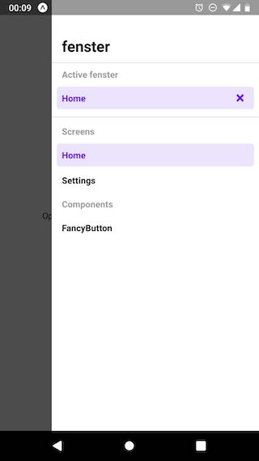

# fenster

fenster for React Native is a simple way to view and develop your components in
isolation. Compared to [storybook](https://storybook.js.org), fenster doesn't
use a second bundler and also doesn't expose another App. Instead fenster is
a part of your app and simply uses the metro bundler, which already bundles your
app. No worries, fenster won't be included in production builds.

fenster stores which component you're currently viewing, so even if you reload
the app to see changes, it won't lose its state.

## Table of Contents

- [Install](#install)
- [Setup](#setup)
- [Usage](#usage)
- [License](#license)

## Install

```sh
npm install fenster
```

## Setup

Wrap your whole app inside `FensterRahmen` and pass an array of components,
which fenster should display.


```js
// App.js

import React from 'react'
import { View, StatusBar } from 'react-native'
import { FensterRahmen } from 'fenster'

import HomeScreen from './HomeScreen'
import fenster from './fenster'

// Frame is optional
const Frame = ({ children }) => (
  <View style={{ flex: 1 }}>
    <StatusBar barStyle="dark-content" backgroundColor="white" />
    {children}
  </View>
)

export default class App extends React.Component {
  render() {
    return (
      <FensterRahmen components={fenster} frame={Frame}> // `frame` is optional
        <HomeScreen />
      </FensterRahmen>
    )
  }
}
```

```js
// fenster.js

import HomeScreen from './HomeScreen'
import FancyButton from './FancyButton'

export default [
  { name: 'Home Screen', component: HomeScreen },
  { name: 'FancyButton', component: FancyButton }
]
```

#### `components`

Array of objects `{ name, component }`, where `name` is the display name in fenster's UI, and `component` is the component to render.

Default: `[]`

#### `frame`

Render prop or react component for the wrapper around the active component inside fenster.

Default:

```js
({ children }) => (
  <View style={{ flex: 1 }}>
    {children}
  </View>
)
```

## Usage

Open the fenster UI by swiping from right to left at the bottom of the
screen.

Close the active fenster by pressing the X next to the active component name.

 

## License

MIT © Timo Mämecke
